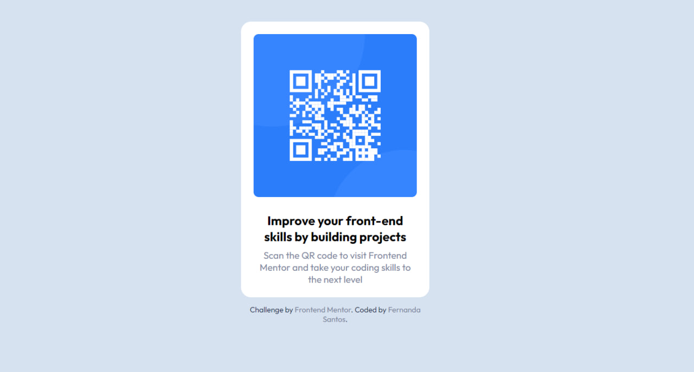

# Frontend Mentor - solução QR code

Essa é uma solução do [desafio QR code component challenge do Frontend Mentor](https://www.frontendmentor.io/challenges/qr-code-component-iux_sIO_H). Os desafios do Frontend Mentor te ajuda a aprimorar suas habilidades com projetos realísticos.
 

## Conteúdo

- [Visão geral](#overview)
  - [Screenshot](#screenshot)
  - [Links](#links)
- [Meu processo](#meu-processo)
  - [Tecnologias usadas](#tecnologias-usadas)
  - [O que aprendi](#o-que-aprendi)
- [Autora](#autora)

**Note: Delete this note and update the table of contents based on what sections you keep.**

## Overview

### Screenshot

### Links

- Solution URL: [Add solution URL here](https://your-solution-url.com)
- Live Site URL: [Add live site URL here](https://your-live-site-url.com)

## Meu processo

### Tecnologias usadas

- HTML5 
- CSS 
- Mobile-first workflow

### O que aprendi

## Autora

- Frontend Mentor - [@yourusername](https://www.frontendmentor.io/profile/yourusername)
- Twitter - [@santos4fer](https://twitter.com/santos4fer?t=C_005ydwl4kRlCgf-SlMgQ&s=09)